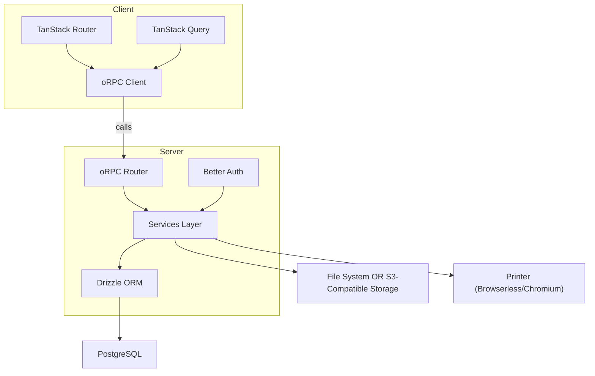

This guide provides a comprehensive overview of Reactive Resume's architecture and codebase structure, helping you understand how different parts of the application work together.

---

## Tech Stack Overview

Reactive Resume is built with a modern, type-safe stack:

<CardGroup cols={2}>
  <Card title="Frontend" icon="browser">
    - **React 19** with TanStack Start
    - **TypeScript** for type safety
    - **Tailwind CSS** for styling
    - **Radix UI** for accessible components
  </Card>
  <Card title="Backend" icon="server">
    - **ORPC** for type-safe RPC
    - **Drizzle ORM** with PostgreSQL
    - **Better Auth** for authentication
    - **Sharp** for image processing
  </Card>
</CardGroup>

---

## Application Architecture



**Diagram:** This flow shows data and control flow between the main architectural layers of Reactive Resume.

---

## Directory Structure

### Root Level

| Directory | Purpose |
|-----------|---------|
| `src/` | Main application source code |
| `public/` | Static assets served directly |
| `locales/` | Translation files (.po format) |
| `migrations/` | Database migration files |
| `docs/` | Mintlify documentation |
| `data/` | Local data storage (fonts, uploads) |
| `scripts/` | Utility scripts |

### Source Code (`src/`)

<AccordionGroup>
  <Accordion title="components/" icon="cube">
    Reusable React components organized by category:
    
    - **`ui/`** — Base UI components (Button, Card, Dialog, etc.)
    - **`resume/`** — Resume-specific components (sections, templates)
    - **`input/`** — Form input components (ColorPicker, RichInput)
    - **`layout/`** — Layout components (Sidebar, LoadingScreen)
    - **`animation/`** — Animation components (Spotlight, TextMask)
    - **`theme/`** — Theme management components
    - **`typography/`** — Font management components
  </Accordion>
  
  <Accordion title="routes/" icon="route">
    File-based routing using TanStack Router:
    
    - **`__root.tsx`** — Root layout with providers
    - **`_home/`** — Public home page routes
    - **`auth/`** — Authentication routes (login, register, etc.)
    - **`dashboard/`** — User dashboard routes
    - **`builder/`** — Resume builder routes (the main editor)
    - **`printer/`** — PDF printing route
    - **`api/`** — API routes
  </Accordion>
  
  <Accordion title="integrations/" icon="plug">
    Third-party service integrations:
    
    - **`auth/`** — Better Auth client configuration
    - **`drizzle/`** — Database schema and utilities
    - **`orpc/`** — API router, client, and services
    - **`ai/`** — AI service integrations
    - **`import/`** — Resume import utilities
  </Accordion>
  
  <Accordion title="dialogs/" icon="window-maximize">
    Modal dialog components:
    
    - **`auth/`** — Authentication dialogs
    - **`resume/`** — Resume management dialogs
    - **`api-key/`** — API key management dialogs
    - **`manager.tsx`** — Dialog manager component
    - **`store.ts`** — Dialog state management (Zustand)
  </Accordion>
  
  <Accordion title="schema/" icon="file-code">
    Zod schemas for validation:
    
    - **`resume/`** — Resume data schemas
    - **`icons.ts`** — Icon definitions
    - **`templates.ts`** — Template definitions
  </Accordion>
  
  <Accordion title="hooks/" icon="hook">
    Custom React hooks:
    
    - `use-confirm.tsx` — Confirmation dialog hook
    - `use-prompt.tsx` — Prompt dialog hook
    - `use-mobile.tsx` — Mobile detection hook
    - `use-safe-context.tsx` — Safe context consumption
  </Accordion>
  
  <Accordion title="utils/" icon="wrench">
    Utility functions:
    
    - `env.ts` — Environment variable validation
    - `locale.ts` — Locale utilities
    - `theme.ts` — Theme utilities
    - `string.ts` — String manipulation
    - `file.ts` — File handling utilities
  </Accordion>
</AccordionGroup>

---

## Key Concepts

### File-Based Routing

Routes are automatically generated from the file structure in `src/routes/`. TanStack Router conventions:

| Pattern | Description | Example |
|---------|-------------|---------|
| `index.tsx` | Index route | `/dashboard` |
| `$param.tsx` | Dynamic parameter | `/builder/$resumeId` |
| `_layout/` | Layout group (prefix) | `_home/` |
| `__root.tsx` | Root layout | Wraps all routes |

<Warning>
  Never edit `src/routeTree.gen.ts` manually — it's auto-generated when you run the dev server.
</Warning>

### API Layer (ORPC)

ORPC provides end-to-end type safety for API calls:

```
src/integrations/orpc/
├── client.ts         # Client-side ORPC setup
├── router/           # API route definitions
│   ├── auth.ts      # Authentication endpoints
│   ├── resume.ts    # Resume CRUD operations
│   └── storage.ts   # File storage operations
├── services/         # Business logic layer
└── helpers/          # Utility functions
```

**Using the API client:**

```tsx
import { useQuery } from "@tanstack/react-query";
import { orpc } from "@/integrations/orpc/client";

// Type-safe API calls with TanStack Query
const { data } = useQuery(orpc.resume.findMany.queryOptions());
```

### State Management

Reactive Resume uses a hybrid approach:

| Type | Tool | Use Case |
|------|------|----------|
| Server State | TanStack Query | API data, caching, sync |
| Client State | Zustand | UI state, dialogs, preferences |
| Form State | React Hook Form | Form inputs and validation |

### Database Schema

The database schema is defined using Drizzle ORM in `src/integrations/drizzle/schema.ts`:

```tsx
import { pgTable, text, timestamp, uuid } from "drizzle-orm/pg-core";

export const resume = pgTable("resume", {
  id: uuid("id").primaryKey().defaultRandom(),
  title: text("title").notNull(),
  slug: text("slug").notNull(),
  // ... more fields
});
```

---

## Common Development Patterns

### Adding a New Component

1. Create the component in the appropriate `src/components/` subdirectory
2. Export it from the directory's index file (if applicable)
3. Use TypeScript props interfaces for type safety
4. Follow existing patterns for consistency

```tsx
// src/components/ui/my-component.tsx
import { cn } from "@/utils/style";

interface MyComponentProps {
  title: string;
  className?: string;
}

export const MyComponent = ({ title, className }: MyComponentProps) => {
  return <div className={cn("p-4", className)}>{title}</div>;
};
```

### Adding a New Route

1. Create a new file in `src/routes/` following TanStack Router conventions
2. The route tree auto-generates when you save
3. Use `createFileRoute` for type-safe routes

```tsx
// src/routes/my-page.tsx
import { createFileRoute } from "@tanstack/react-router";

export const Route = createFileRoute("/my-page")({
  component: MyPage,
});

function MyPage() {
  return <div>My Page Content</div>;
}
```

### Adding an API Endpoint

1. Add the route handler in `src/integrations/orpc/router/`
2. Create service functions in `src/integrations/orpc/services/` if needed
3. The endpoint is automatically typed on the client

```tsx
// In router file
import { z } from "zod";
import { publicProcedure, router } from "../server";

export const myRouter = router({
  hello: publicProcedure
    .input(z.object({ name: z.string() }))
    .handler(async ({ input }) => {
      return { message: `Hello, ${input.name}!` };
    }),
});
```

### Adding Translations

1. Wrap text with `t` macro or `<Trans>` component
2. Run `pnpm run lingui:extract` to update locale files
3. Edit the `.po` files in `locales/` to add translations

```tsx
import { t } from "@lingui/core/macro";
import { Trans } from "@lingui/react/macro";

// In component
const title = t`Welcome`;
<Trans>Click here to continue</Trans>
```

---

## Configuration Files

| File | Purpose |
|------|---------|
| `vite.config.ts` | Vite bundler configuration |
| `tsconfig.json` | TypeScript configuration |
| `biome.json` | Linter and formatter settings |
| `drizzle.config.ts` | Drizzle ORM configuration |
| `lingui.config.ts` | Lingui i18n configuration |
| `components.json` | shadcn/ui component configuration |

---

## Contributing Guidelines

<Steps>
  <Step title="Fork & Clone">
    Fork the repository on GitHub and clone your fork locally.
  </Step>
  
  <Step title="Create a Branch">
    Create a feature branch from `main`:
    ```bash
    git checkout -b feature/my-feature
    ```
  </Step>
  
  <Step title="Make Changes">
    Implement your changes following the patterns described above.
  </Step>
  
  <Step title="Test Locally">
    Ensure the app works correctly with your changes:
    ```bash
    pnpm run dev
    pnpm run lint
    pnpm run typecheck
    ```
  </Step>
  
  <Step title="Commit & Push">
    Write clear commit messages and push to your fork.
  </Step>
  
  <Step title="Open a Pull Request">
    Open a PR against the main repository with a clear description of your changes.
  </Step>
</Steps>

<Note>
  Make sure to read any `CONTRIBUTING.md` file in the repository for additional guidelines.
</Note>

---

## Need Help?

<CardGroup cols={2}>
  <Card
    title="GitHub Discussions"
    icon="comments"
    href="https://github.com/pickit420/reactive-resume-v2/discussions"
  >
    Ask questions and discuss ideas with the community.
  </Card>
  <Card
    title="GitHub Issues"
    icon="bug"
    href="https://github.com/pickit420/reactive-resume-v2/issues"
  >
    Report bugs or request features.
  </Card>
</CardGroup>
